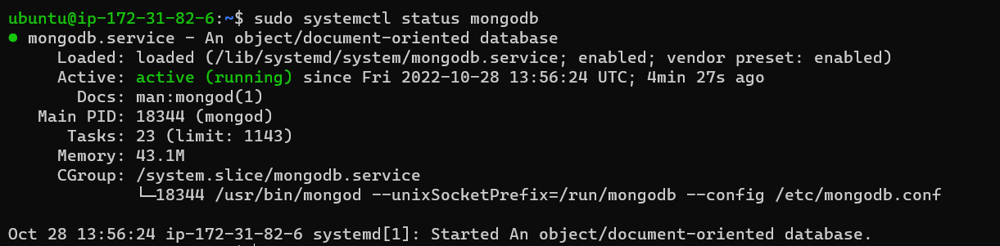
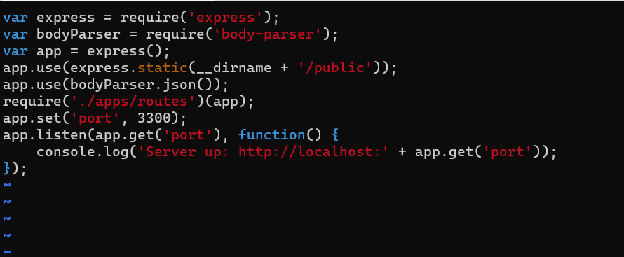
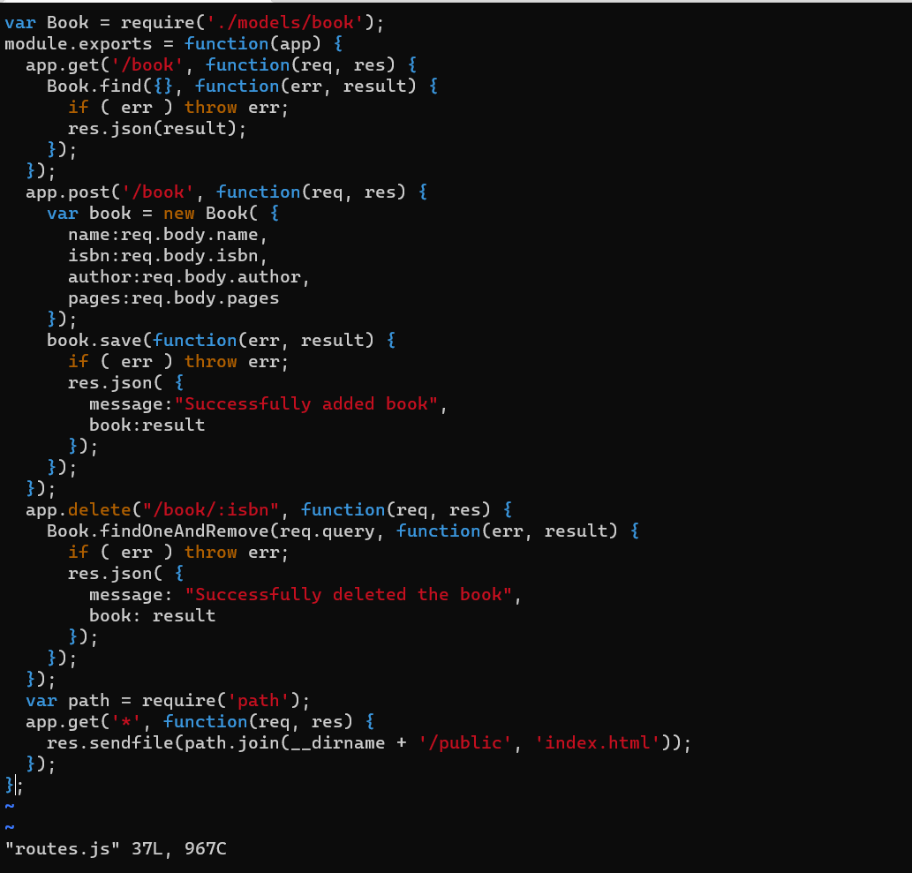
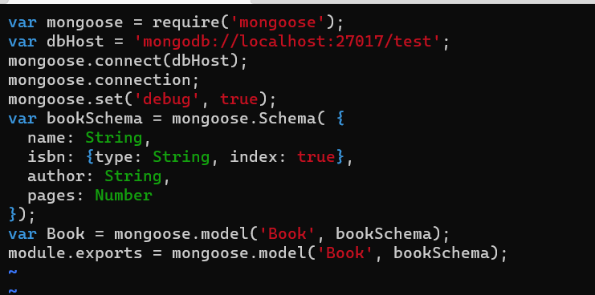
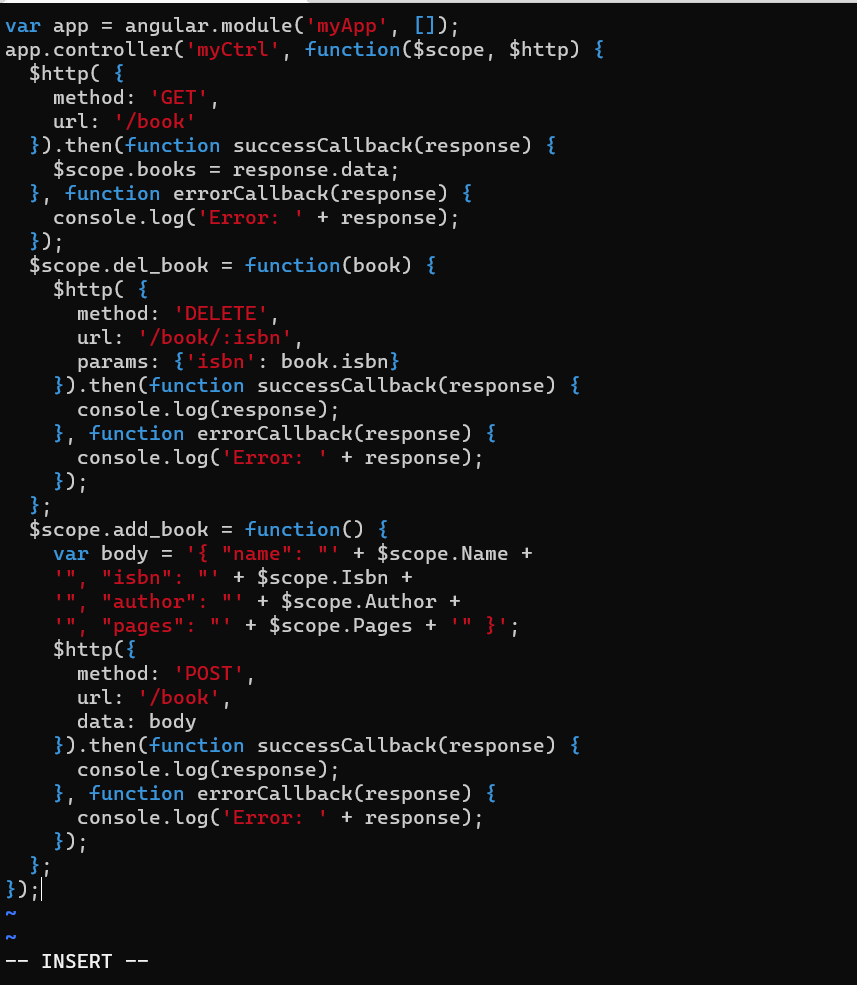

## PROJECT 4: MEAN STACK IMPLEMENTATION

___
### **STEP 1: NODEJS INSTALLATION**
___

I ran the following commands on my virtual machine to update a list of packages in the Ubuntu package manager and to upgrade the Ubuntu OS:

`sudo apt update`

`sudo apt upgrade`

Next, I installed NodeJS by running the command below:

`sudo apt install -y nodejs`

### **STEP 2: MONGODB INSTALLATION**

To install the MongoDB, I ran the commands below:

`sudo apt-key adv --keyserver hkp://keyserver.ubuntu.com:80 --recv 0C49F3730359A14518585931BC711F9BA15703C6`

`echo "deb [ arch=amd64 ] https://repo.mongodb.org/apt/ubuntu trusty/mongodb-org/3.4 multiverse" | sudo tee /etc/apt/sources.list.d/mongodb-org-3.4.list`

`sudo apt install -y mongodb`

I then started the server by running:

`sudo systemctl start mongodb`

I checked the status with the command below:

`sudo systemctl status mongodb`

Next, I installed npm – Node package manager, as below:

`sudo apt insatll -y npm`

Next, I installed **body-parser** package, as below:

`sudo npm install body-parser`

Next, I created a new directory *Books* and changed directory into the newly created folder

`mkdir Books && cd Books`

In the Books directory, I initialize npm project with the command below and followed the prompt:

`npm init`

Next, I add a file to it using Vim named it server.js and I pasted in the code provided, as displayed below:

### STEP 3: INSTALL EXPRESS AND SET UP ROUTES TO THE SERVER

First, I installed Mongoose with the following command:

`sudo npm install express mongoose`

In the ‘Books’ folder, I created a folder named 'apps' and cd'd into it:

`mkdir apps && cd apps`

Next, I created a file named 'routes.js' using Vim and pasted in the code given as shown below:

Next, in the ‘models’ folder, I created a folder named 'models' and cd'd into it:

`mkdir models && cd models`

Next, I created a file named 'book.js' using Vim and pasted in the code given as shown below:

### STEP 4: ACCESSING THE ROUTES WITH ANGULARJS

First, I changed directory back to the Book directory

In the ‘Books’ folder, I created a folder named 'public' and cd'd into it:

`mkdir public && cd public`

Next, I created a file named 'script.js' using Vim and pasted in the code given as shown below:

`vi script.js`

